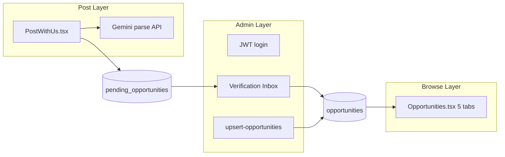
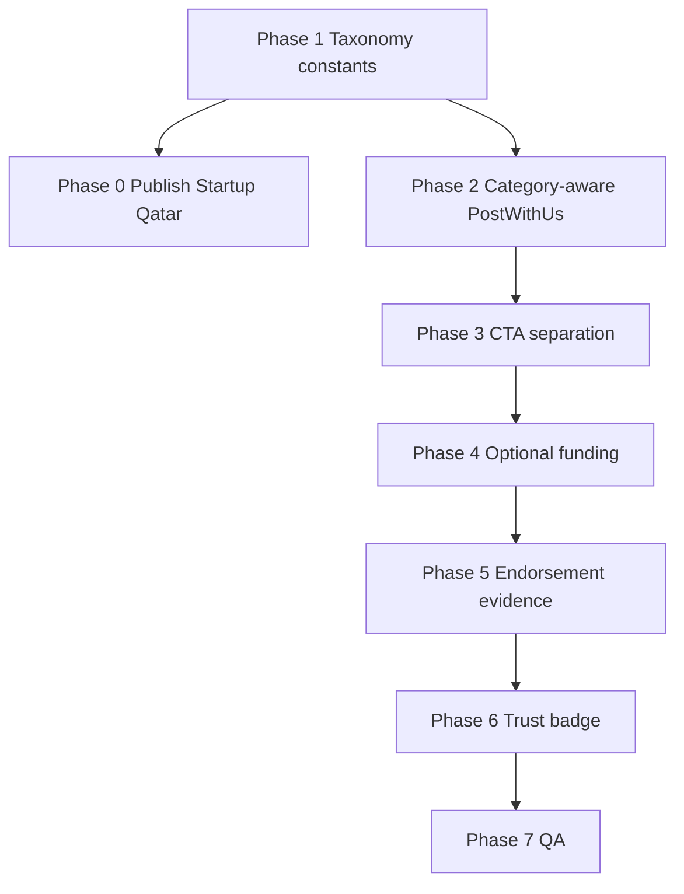

# Platform Taxonomy & Optional Funding Plan

Based on your new taxonomy proposal, here is the updated plan for the 5 tabs and how the categories (including Funding) will be distributed:

## Proposed Changes

### 1. New 5-Tab Structure & Taxonomy

1. **All**: The global feed showing absolutely everything.
2. **Jobs**: 
   - *Categories*: Job, Microgig.
   - *Description*: Strictly for transactional or formal employment.
3. **Academic & Career**: 
   - *Categories*: Internship, Attachment, Conference, Call for Papers, Event, Volunteer.
   - **Academic Funding**: Scholarship, Fellowship, Academic Grant. *(Scholarships and fellowships are deeply tied to academic/career advancement)*.
4. **Innovation**: 
   - *Categories*: Hackathon, Industry Challenge.
   - **Startup Funding**: Seed Funding, Startup Grants, Accelerator Programs. *(This is the perfect home for startup capital, as it aligns with tech, challenges, and building new ventures!)*
5. **Projects**: 
   - *Categories*: Student Project, Community Initiative.
   - *Description*: Grassroots initiatives seeking resources (funding, volunteers, or labor).

### 2. Make "Funding" Optional for Projects
- **Form Update (`PostWithUs.tsx`)**: When a user selects "Community Project" or "Student Project", we will add a checkbox: `[ ] Are you looking to raise funds for this project?`
- **Logic**: If they don't check it, the crowdfunding goal (target amount) won't be required.
- **Display Update (`OpportunityDetails.tsx`)**: If a project doesn't have a funding goal, the UI will hide the progress bar and "Contribute" buttons, and instead display a "Volunteer / Help Out" button.

### 3. Trust & Verification Badge
- We will add an informational section near the "Contribute" button that explains how funds are verified (e.g., "Funds are routed directly to verified institutional/organizational accounts. Creators are verified via departmental letters/deans before payouts.").
- We will remove the ugly horizontal scrollbar on the tabs list.

## User Review Required

> [!IMPORTANT]
> **Button Text for Non-Funded Projects**
> If a project is strictly looking for labor/help instead of money, I will change the primary button from "Contribute" to **"Volunteer / Help Out"**. 

Does splitting the funding (Academic Funding to **Academic & Career**, and Startup Funding to **Innovation**) solve the problem perfectly? Let me know and I will begin the implementation!


WHAT CURSOR WAS TRUING AN DSTPPPED MID


---
name: Taxonomy and Projects CMS
overview: Phased rollout of the implementation_plan.md taxonomy, category-aware Post With Us forms, clear separation between Industry Challenges and Student/Community Projects, institutional evidence for trust, and publishing the curated Startup Qatar opportunity—without breaking existing admin JWT auth or escrow flows.
todos:
  - id: phase-1-taxonomy
    content: "Phase 1: Create shared category constants; align Opportunities.tsx, PostWithUs dropdown, and Gemini parser prompt; fix tab scrollbar"
    status: completed
  - id: phase-0-publish-qatar
    content: "Phase 0: Upsert Startup Qatar JSON via admin JWT after Phase 1; verify Innovation tab + detail page"
    status: in_progress
  - id: phase-2-category-fields
    content: "Phase 2: CATEGORY_FIELD_RULES in PostWithUs — hide compensation for projects, show/hide fields per category"
    status: completed
  - id: phase-3-cta-separation
    content: "Phase 3: Fix OpportunityDetails CTA matrix; remove industry-challenge copy from Student/Community project content"
    status: completed
  - id: phase-4-optional-funding
    content: "Phase 4: Optional funding checkbox for projects; Volunteer/Help Out CTA when isEscrow false"
    status: completed
  - id: phase-5-endorsement
    content: "Phase 5: institutionalEndorsement schema + PostWithUs upload/link + public trust section on OpportunityDetails"
    status: completed
  - id: phase-6-trust-badge
    content: "Phase 6: Trust explainer near Contribute button for funded projects"
    status: completed
  - id: phase-7-qa
    content: "Phase 7: End-to-end QA matrix + grandfather/migrate existing project records"
    status: pending
isProject: false
---

# Phased Plan: Taxonomy, Projects Trust, and Publishing

## Current state (what already exists)

| Area | Status |
|------|--------|
| 5-tab browse UI | Mostly done in [`src/pages/Opportunities.tsx`](src/pages/Opportunities.tsx) (All, Jobs, Academic & Career, Innovation, Projects) |
| Admin JWT auth | Done: [`backend/src/server.js`](backend/src/server.js) `POST /api/admin/login`, [`src/components/ProtectedRoute.tsx`](src/components/ProtectedRoute.tsx), Bearer token in [`src/pages/admin/AdminDashboard.tsx`](src/pages/admin/AdminDashboard.tsx) |
| AI parser + Post With Us | Done in [`src/pages/PostWithUs.tsx`](src/pages/PostWithUs.tsx) + [`backend/src/routes/public.js`](backend/src/routes/public.js) / [`backend/src/routes/admin.js`](backend/src/routes/admin.js) |
| Project crowdfunding | Partial: funding goal always shown for Project/StudentProject; `isEscrow` only when goal > 0 |
| KYC upload (poster) | Partial: file upload to backend, **admin-only** view via `/api/admin/kyc/:filename` |
| "Make This Your Project" CTA | Shows for **any** opportunity without `applicationLink` — incorrectly includes Student/Community projects |
| `implementation_plan.md` items | Optional funding checkbox, Volunteer CTA, trust badge near Contribute — **not implemented** |
| Startup Qatar JSON | Ready at [`OPPORTUNITIES/startup-qatar-investment-program.json`](OPPORTUNITIES/startup-qatar-investment-program.json), image at `public/images/startup_qatar.png` |



---

## Category model (canonical — align everything to this)

Mirror [`implementation_plan.md`](implementation_plan.md) plus existing backend values:

| Tab | Categories (DB value) | Notes |
|-----|-------------------------|-------|
| **All** | everything | |
| **Jobs** | `Gig`, `Job` | Employment / microgigs |
| **Academic & Career** | `Internship`, `Attachment`, `Conference`, `CallForPapers`, `Event`, `Volunteer`, `Scholarship`, `Fellowship`, `Grant` | Academic funding lives here |
| **Innovation** | `Hackathon`, `Challenge`, `StartupFunding` | Industry challenges + startup capital |
| **Projects** | `StudentProject`, `Project` | Grassroots / student initiatives |

**Key separation rule:** `Challenge` = open **industry** brief (inspiration, capstone, no crowdfunding). `StudentProject` / `Project` = poster-submitted initiatives (collaboration, optional crowdfunding, institutional evidence).

---

## Compensation recommendation (Student & Community Projects)

**Recommendation: hide Compensation field and auto-set `compensationType: 'N/A'`** for `StudentProject` and `Project`.

| Category | Compensation UI | Why |
|----------|-----------------|-----|
| StudentProject, Project | Hidden, forced `N/A` | These are not jobs; money flows via **crowdfunding (`isEscrow`)** or **volunteer/collaboration**, not salary |
| Gig, Job | Paid / Stipend / Unpaid | Standard employment |
| Partnership | Equity option visible | Fits co-founder / equity deals |
| Scholarship, Grant, Fellowship, CFP, Conference | Hidden, `N/A` | Already partially done |
| Challenge, Hackathon | Hidden or `N/A` | Prizes expressed in `benefits` / `fundingType`, not compensation |

Do **not** use Equity for student/community projects unless you later add a dedicated "Equity partnership" category — it confuses funders.

On [`OpportunityDetails.tsx`](src/pages/OpportunityDetails.tsx), suppress the compensation badge when value is `N/A`.

---

## Phase 0 — Publish Startup Qatar (after Phase 1 category constants)

**Goal:** Push curated international startup funding listing without waiting for full Post With Us rework.

- Use existing JSON [`OPPORTUNITIES/startup-qatar-investment-program.json`](OPPORTUNITIES/startup-qatar-investment-program.json)
- Category: `StartupFunding` (Innovation tab — already supported in [`Opportunities.tsx`](src/pages/Opportunities.tsx))
- Publish via `POST /api/admin/upsert-opportunities` with admin JWT (no manual API key)
- Verify public page: `/opportunity/startup-qatar-investment-program`
- Ensure `fullDescription`, `thematicAreas`, `benefits`, links (`applicationLink`, `contactLink`), `deadline: "Rolling"` render correctly

**No schema change required** — existing [`Opportunity`](src/data/opportunities.ts) interface fits.

---

## Phase 1 — Taxonomy alignment (foundation)

**Files:** [`src/pages/Opportunities.tsx`](src/pages/Opportunities.tsx), [`src/pages/PostWithUs.tsx`](src/pages/PostWithUs.tsx), [`backend/src/routes/public.js`](backend/src/routes/public.js) (parser prompt), optional shared constants file e.g. `src/constants/categories.ts`

1. **Extract shared category config** (single source of truth):
   - tab id, category value, display label, optgroup for Post With Us
2. **Fix Post With Us category dropdown** — currently mis-grouped (Projects under "Career and Innovation"):

```748:768:src/pages/PostWithUs.tsx
<optgroup label="Career and Innovation">
  ...
  <option value="Project">Community Project</option>
  <option value="StudentProject">Student Project</option>
```

   Reorganize to match 5-tab taxonomy; add missing `StartupFunding`, `Fellowship`, `Partnership` if still needed.

3. **Parser prompt** — ensure Gemini categories match canonical list (include `StartupFunding`, separate `Challenge` vs `Project`).

4. **Tabs UI polish** from plan: remove horizontal scrollbar on tab list in [`Opportunities.tsx`](src/pages/Opportunities.tsx).

---

## Phase 2 — Category-aware Post With Us fields

**File:** [`src/pages/PostWithUs.tsx`](src/pages/PostWithUs.tsx)

Create a small `CATEGORY_FIELD_RULES` map driven by selected category:

| Category group | Show | Hide / auto-set |
|----------------|------|-----------------|
| Jobs (`Gig`, `Job`) | Compensation, optional job escrow checkbox | fundingType → Not Applicable |
| Academic funding | fundingType | compensation → N/A |
| Innovation (`Hackathon`, `Challenge`, `StartupFunding`) | fundingType, application link | compensation → N/A (except Hackathon prizes in benefits) |
| Projects (`StudentProject`, `Project`) | endorsement block, optional funding checkbox (Phase 3), collaboration fields | compensation hidden → N/A, upfront cost hidden |
| `Challenge` | No funding goal, no KYC, no M-PESA | |

Extend existing `handleBasicInfoEdit` logic (lines ~225–236) to use the rules map instead of scattered `includes()` checks.

**AI review step:** When category changes after parse, re-validate visible fields and clear invalid values (e.g. clear `escrowAmount` when switching to `Challenge`).

---

## Phase 3 — Separate Industry Challenges from Projects (copy + CTAs)

**Files:** [`src/pages/OpportunityDetails.tsx`](src/pages/OpportunityDetails.tsx), seed content in [`src/data/opportunities.ts`](src/data/opportunities.ts), [`backend/seed.js`](backend/seed.js)

### Problem today
"Make This Your Project" renders for **any** listing without `applicationLink` — including Student/Community projects:

```1181:1185:src/pages/OpportunityDetails.tsx
<h3>Make This Your Project</h3>
<p>This is an open industry challenge — no formal application needed...</p>
```

### Fix — CTA matrix

| Category | Primary CTA |
|----------|-------------|
| `Challenge` | **Explore / Use as Research Inspiration** (keep capstone language) |
| `StudentProject`, `Project` + `isEscrow` | **Contribute** (existing) |
| `StudentProject`, `Project` + no `isEscrow` | **Volunteer / Help Out** + Contact Creator |
| Has `applicationLink` | **Apply Now** (unchanged) |

### Content cleanup
- Audit `fullDescription` / `benefits` on NRW challenge and similar entries — remove "final year project / capstone" phrasing from **StudentProject** and **Project** listings (keep only on `Challenge`).
- Add lint/copy rule in admin review checklist: "Industry challenge language must not appear on project posts."

---

## Phase 4 — Optional project funding (from implementation_plan.md)

**Files:** [`src/pages/PostWithUs.tsx`](src/pages/PostWithUs.tsx), [`src/pages/OpportunityDetails.tsx`](src/pages/OpportunityDetails.tsx)

### Post With Us
Replace always-visible "Funding Goal (KES)" block (lines ~831–858) with:

1. Checkbox: **"Are you looking to raise funds for this project?"**
2. If checked → show funding goal + M-PESA payout number (required)
3. If unchecked → `isEscrow: false`, hide escrow fields, set project mode to collaboration/volunteer

### Opportunity Details
- If `Project` / `StudentProject` && `!isEscrow` → hide progress bar + Contribute dialog; show **Volunteer / Help Out** (opens Contact Creator / pitch flow)
- If `isEscrow` → existing crowdfunding UI + trust badge (Phase 5)

---

## Phase 5 — Institutional endorsement evidence (both project types)

**User decision:** Required for **both** Student Projects and Community Projects.

### Data model extension ([`src/data/opportunities.ts`](src/data/opportunities.ts))

```ts
institutionalEndorsement?: {
  institutionName: string;       // e.g. "KU Dept of Engineering"
  contactTitle: string;          // e.g. "Head of Department"
  evidenceType: 'upload' | 'link';
  evidenceUrl: string;           // public Google Drive link OR CDN URL for redacted PDF/image
  adminEvidenceFile?: string;    // internal filename (existing kycProofFilename pattern)
};
```

Keep `kycProofFilename` for admin raw review; add **`endorsementPublicUrl`** (or nested object above) for **public** trust display.

### Post With Us
- Required fields for `StudentProject` + `Project`:
  - Institution name, endorser role (HOD / community org lead)
  - **Either** file upload (screenshot/PDF of email) **or** Google Drive link (viewer-accessible)
- Copy: institution must email `admin@opportunities.ke` for double-check; uploaded evidence is what funders can verify

### Backend
- [`backend/src/routes/public.js`](backend/src/routes/public.js): accept + store endorsement fields on pending submit
- New optional **public-safe** file route OR store Drive link only on approved opportunities (prefer link for public to avoid leaking raw uploads)
- [`backend/src/routes/admin.js`](backend/src/routes/admin.js) approve flow: copy endorsement into live opportunity doc

### Opportunity Details — public trust section
New block **"Institutional Verification"** (Projects tab only):
- Institution name + endorser role
- Button: **View endorsement evidence** (opens `evidenceUrl` in new tab)
- Short explainer: "We verify endorsement emails from department heads or recognized community organizations before publishing."

Admin dashboard inbox: keep existing KYC viewer; show endorsement metadata alongside.

---

## Phase 6 — Trust badge near Contribute

**File:** [`src/pages/OpportunityDetails.tsx`](src/pages/OpportunityDetails.tsx)

Add info panel above Contribute button (only when `isEscrow`):

> Funds are held securely. Creators are verified via institutional endorsement before publishing. Platform fee 5% applies.

Link to endorsement evidence section when available.

---

## Phase 7 — Admin publish workflow + QA

1. **Startup Qatar** upsert (Phase 0)
2. Test matrix:

| Flow | Test |
|------|------|
| Post StudentProject, no funding | Volunteer CTA, endorsement required, no compensation shown |
| Post StudentProject, with funding | Contribute UI + trust badge |
| Post Challenge | "Make this your project" style CTA, no KYC |
| Post StartupFunding | Appears under Innovation tab |
| Admin approve project | Endorsement visible on public page |

3. Migration note: existing Project/StudentProject records without endorsement — grandfather as unverified or prompt admin to add evidence on edit.

---

## Suggested implementation order



**Do not publish Startup Qatar until Phase 1 confirms `StartupFunding` is stable** (small change, ~1 hour).

---

## Files touched (summary)

| Phase | Primary files |
|-------|---------------|
| 0 | `OPPORTUNITIES/startup-qatar-investment-program.json`, admin upsert |
| 1 | `Opportunities.tsx`, `PostWithUs.tsx`, `public.js` parser, new `categories.ts` |
| 2–4 | `PostWithUs.tsx`, `OpportunityDetails.tsx` |
| 5 | `opportunities.ts` type, `public.js`, `admin.js`, `OpportunityDetails.tsx`, `AdminDashboard.tsx` |
| 6 | `OpportunityDetails.tsx` |
| 7 | Content in `opportunities.ts`, `seed.js` |

No change to JWT admin auth is required for this work.

